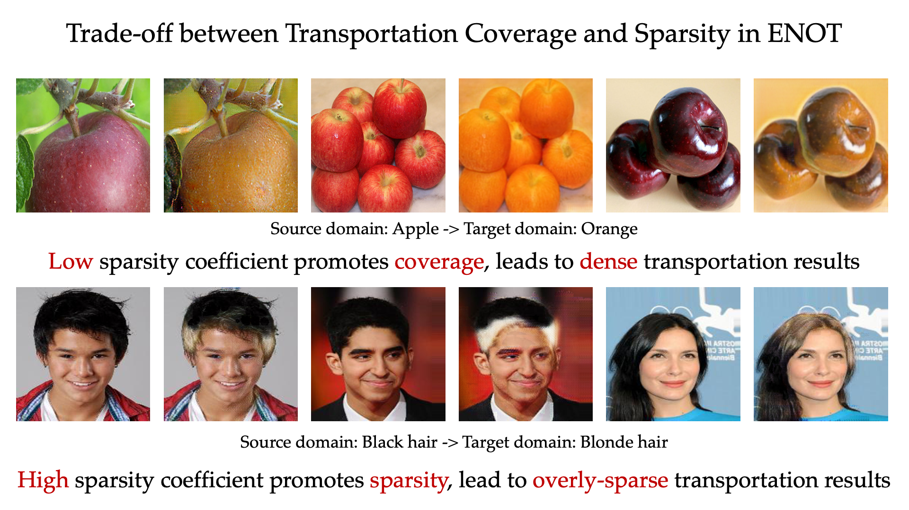
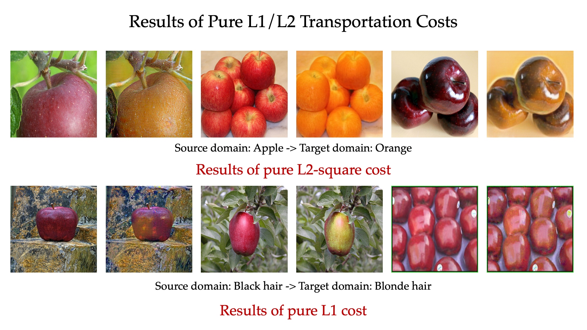

# Sparse Domain Transfer via Elastic Net Regularization

## Figure 1
Trade-off between transportation coverage and sparsity in ENOT. Low sparsity coefficient promotes coverage, leads to dense transportation results. High sparsity coefficient promotes sparsity, lead to overly-sparse transportation results.

## Figure 2
Extension to comparison results with pure $L_2$-square and $L_1$ costs. Pure $L_2$-square cost lead to dense transportations with unnecessary modifications, and pure L1 cost lead to suboptimal results.

